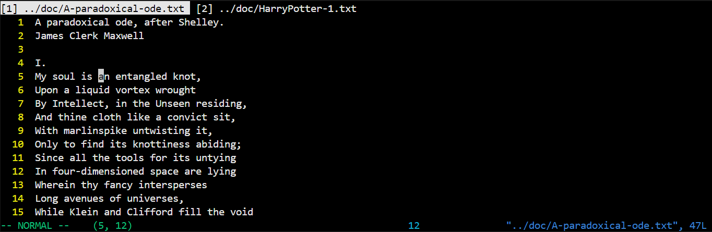
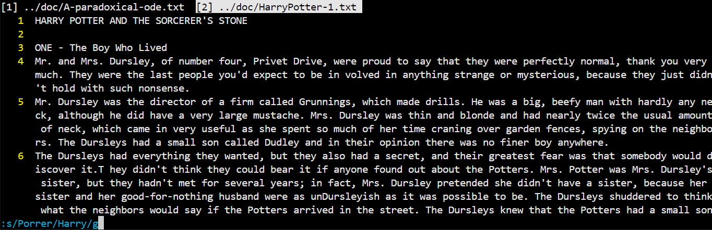

# Vixx Project Documentation

**Authors**:  
- Zhanwei Zhang (12110817@mail.sustech.edu.cn)
- Zhiyu Zhao (12110814@mail.sustech.edu.cn)

**Date**: January 2025

## Introduction

This project aims to implement a lightweight version of the Vim text editor in C++, focusing on replicating its core functionalities. Vim is renowned for its efficiency in text editing through keyboard shortcuts. Our Vixx replicates three primary modes: **Normal Mode**, **Insert Mode**, and **Command-Line Mode**, along with additional advanced features for enhanced functionality.

---

## Features Overview

### 1. Basic Features

#### Normal Mode
- **Purpose**: Default mode for navigating and manipulating text.
- **Key Functionalities**:
  - **Cursor Movement**:
    - `h`, `j`, `k`, `l`: Move cursor left, down, up, and right.
    - `←`, `↓`, `↑`, `→`(Arrey keys): Move cursor left, down, up, and right.
    - `0`: Jump to the beginning of the current line.
    - `$`: Jump to the end of the current line.
    - `gg`: Move to the first line.
    - `G`: Move to the last line.
  - **Line Operations**:
    - `dd`: Delete the current line.
    - `yy`: Copy the current line.
    - `p`: Paste copied content below the cursor.
  - Press `i` to enter **Insert Mode**.
  - Press `:` to enter **Command-Line Mode**.

#### Insert Mode
- **Purpose**: Allows direct text entry like traditional editors.
- **Cursor Movement**:
  - `←`, `↓`, `↑`, `→`(Arrey keys): Move cursor left, down, up, and right.
- **Key Functionalities**:
  - Supports real-time text input with the cursor following the text.
  - `Enter`: Create a new line from the cursor and move the cursor to its beginning.
  - `Backspace`: Delete characters, including line transitions.
  - Press `Esc` to return to **Normal Mode**.

#### Command-Line Mode
- **Purpose**: Execute commands for file operations and advanced tasks.
- **Key Functionalities**:
  - Commands include:
    - `:w`: Save the current file.
      - If no file name specified when running `vixx`, you need to use `:w <filename>` to specify a filename.
    - `:q`: Quit the editor.
    - `:wq`: Save and quit.

This program can correctly deal with a line of text that is too long, and it can correctly deal with columns that are overflow the scope of the window.  When user moving the cursor, the text in the window automatically scrolls to the area where the cursor is located.

---

### 2. Advanced Features

#### (1) Line Numbers and Navigation
- **Feature**: Display line numbers for reference.
- **Command**: [line_number]+`G`. For example, `12G` will move the cursor to line 12.

#### (2) Repetitive Cursor Movement
- **Command**: [number]+[arrow_key]. For example, `5→` will move the cursor 5 characters to the right.

#### (3) Search and Replace
- **Command**: `:s/old/new/g`: Replace all occurrences of `old` with `new` in the text.

#### (4) Undo and Redo
- **Commands**:
  - `u`: Undo the last action.
  - `Ctrl+R`: Redo the last undone action.

#### (5) Multi-File Editing (TODO)
- **Feature**: Open multiple files simultaneously.
- **Usage**: Seamlessly switch between files for editing.

---

## How to Use Vixx

1. **Launch the Editor**:
   - Open the terminal and run the program by `vixx <filePath>`.
2. **Program Window**:

   - The yellow numbers in the left column are line numbers.
   - The white text in the middle is the text content.
   - The green text on the left side of the bottom row indicates the Mode and the position of cursor.
   - The light blue number in the middle of the bottom row is the Normal numeric control record.
   - The blue text on the right side of the bottom row gives the file name, relative path, and total number of lines.
3. **Command-Mode Input**:

   - When typing in command mode, the bottom line is temporarily replaced with light blue command input.
3. **Perform Operations**:
   - Follow the commands outlined in the feature sections.
4. **Save and Quit**:
   - Use `:wq` to save changes and exit.
   - Use `:q` to exit directly.

---

## Design Highlights

- **Core Functionalities**: Implemented using keyboard-based commands to simulate authentic Vim behavior.
- **User Interface**: Clean and minimalist terminal UI for efficient text editing.
- **Performance**: Optimized for real-time updates and smooth navigation.

---

## Acknowledgments

Thanks to the provided project requirements and documentation resources for guiding this implementation. Special gratitude to the open-source Vim community for inspiration.

---

Enjoy exploring Vixx! Master its shortcuts and experience efficient text editing.
